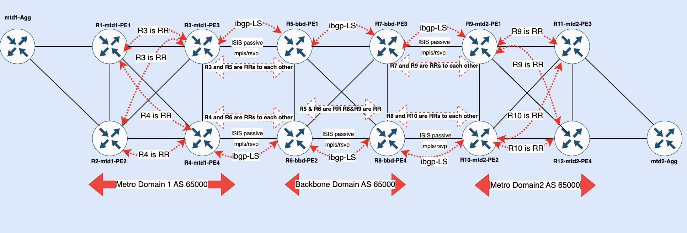

# Inter-Domain-Traffic-Engineering-and-MPLS-LSPs

RSVP-TE offers rich feature set for traffic engineering in MPLS backbone networks but RSVP-TE is dependent on IGP (ISIS/OSPF) for distribution of link state information across MPLS backbone networks which are usually designed to have single area (backbone area) stretched across whole MPLS BB. Having single IGP area stretched across whole MPLS BB network is simpler in term of configuration and troubleshooting / operation management but there is downside as well. Let's suppose MPLS backbone network scales to large extent and IGP is working stable but suddenly a situation happens where multiple links start flapping and as per IGP operation IGP link state advertisement will be re-flooded on each link flap across whole backbone network. Due to high resources in modern routers it should not pose any threat to stability of network but it's not only IGP link flaps that we need to worry about , but RSVP-TE itself also feed IGP (adjustable via configuration) about actual link bandwidth utilization and that information needs to delivered to whole MPLS backbone domain so that ingress PE routers can take decision for auto band witdh adjustment while keeping in view current bandwidth utilization of provider links. This information has to be distributed very fast across IGP / MPLS BB network and if it couples with extensive link flaps events then some awful situation could happen across MPLS BB (software stack could get into resource contentions to handle both of these events at same time)

To resolve above mentioned challenges , one approach could be to distribute IGP into multiple areas but problem is traffic engineering database (TED) which is populated from IGP traffic engineering information can not be traversed IGP boundaries. Hence RSVP-TE LSPs are dependent upon TED and due to non-availability of TED across multiple IGP areas RSVP-TE LSPs across multiple IGP areas would not come up.  Thanks to brilliant minds who contributed for [rfc7752](https://datatracker.ietf.org/doc/html/rfc7752) , this RFC explains operation of BGP-LS (link stat) where IGP link state information from TED can be distributed via BGP.

In this write up , I will explain , in Junos how to set up RSVP-TE LSPs across multiple IGP areas using BGP-LS. Prior to discussing actual configuration it's important to understand different components involved in this process.   

Above diagram explains this whole operation in chronological order , IGP populates TED and ls dist.0 routing table is populated information from TED using import policy , once ls dist.0 routing is populated then that information is exported into BGP-LS , which also receives TED from peer router and that information is placed into ls dist.0 from where it is exported to TED. Once TED is populated from across domain information then REVP-TE has required information to build the across domain traffic engineered LSPs.

Lab configurations are difficult to assimilate without understanding lab topology so lets first understand our lab topology.

We have 3 domains (metro domain 1 (mtd1), backbone domain (bbd) and metro domain2 (mtd2), all domains have same autonomous-system (AS) i.e 65000. These domains are connected via Border Router (BR) using iBGP-LS.  Within these domains RSVP is configured as mpls signaling protocol and each domain has its own iBGP and Route Reflector (RR) for that domain. 

Question arises if we are running iBGP-LS between domains and within domains then how iBGP routes will be advertised between domain as have same AS on BGP updates between domain will result into routes discard.  BGP Route Reflector rules will rescue us here, i.e iBGP updates received on RR are reflected to RR clients and non-client iBGP Peers as well, we will configure 2 RR clusters on each border router (internal bgp group as RR within the domain) and "br" group as RR between the domains and BR (Border Routers) opposite to each other will be configured as RR. Routes between iBGP based BR are accepted due to Cluster-ID attribute which is added by each BR while advertising routes to opposite BR.  Logical topology is depicted below:-

