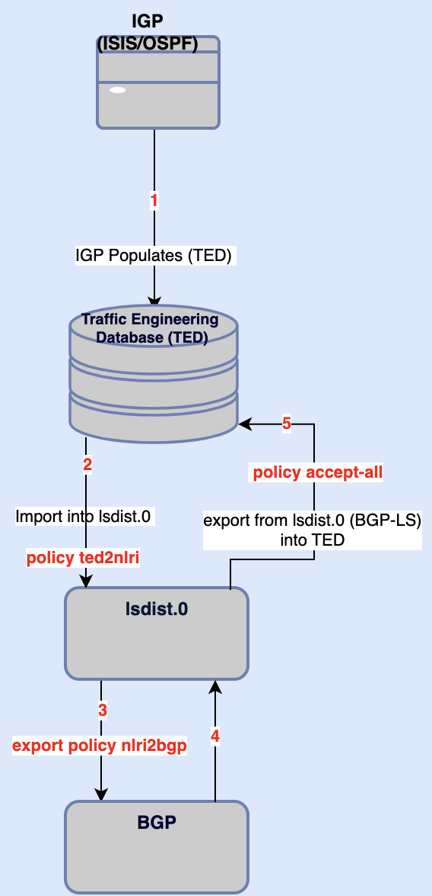

# Inter-Domain-Traffic-Engineering-and-MPLS-LSPs

RSVP-TE offers rich feature set for traffic engineering in MPLS backbone networks but RSVP-TE is dependent on IGP (ISIS/OSPF) for distribution of link state information across MPLS backbone networks which are usually designed to have single area (backbone area) stretched across whole MPLS BB. Having single IGP area stretched across whole MPLS BB network is simpler in term of configuration and troubleshooting / operation management but there is downside as well. Let's suppose MPLS backbone network scales to large extent and IGP is working stable but suddenly a situation happens where multiple links start flapping and as per IGP operation IGP link state advertisement will be re-flooded on each link flap across whole backbone network. Due to high resources in modern routers it should not pose any threat to stability of network but it's not only IGP link flaps that we need to worry about , but RSVP-TE itself also feed IGP (adjustable via configuration) about actual link bandwidth utilization and that information needs to delivered to whole MPLS backbone domain so that ingress PE routers can take decision for auto band witdh adjustment while keeping in view current bandwidth utilization of provider links. This information has to be distributed very fast across IGP / MPLS BB network and if it couples with extensive link flaps in a very large scale netowrk can introduce undesireable scenario. 

To resolve above mentioned challenges , one approach could be to distribute IGP into multiple areas but problem is traffic engineering database (TED) which is populated from IGP traffic engineering information can not be traversed IGP boundaries. Hence RSVP-TE LSPs are dependent upon TED and due to non-availability of TED across multiple IGP areas RSVP-TE LSPs across multiple IGP areas would not come up.  Thanks to brilliant minds who contributed for [rfc7752](https://datatracker.ietf.org/doc/html/rfc7752) , this RFC explains operation of BGP-LS (link stat) where IGP link state information from TED can be distributed via BGP.

## Solution at Glance  
In this write up , I will explain , in Junos how to set up RSVP-TE LSPs across multiple IGP areas using BGP-LS. Prior to discussing actual configuration it's important to understand different components involved in this process.   


Above diagram explains this whole operation in chronological order , IGP populates TED and ls dist.0 routing table is populated information from TED using import policy , once ls dist.0 routing is populated then that information is exported into BGP-LS , which also receives TED from peer router and that information is placed into ls dist.0 from where it is exported to TED. Once TED is populated from across domain information then REVP-TE has required information to build the across domain traffic engineered LSPs.

## Physical and Logical Design 
Lab configurations are difficult to assimilate without understanding lab topology so lets first understand our lab topology.


We have 3 domains (metro domain 1 (mtd1), backbone domain (bbd) and metro domain2 (mtd2), all domains have same autonomous-system (AS) i.e 65000. These domains are connected via Border Routers (BRs) using iBGP-LS.  Within these domains RSVP is configured as mpls signaling protocol and each domain has its own iBGP and Route Reflector (RR) for that domain. 

Question arises if we are running iBGP-LS between domains and iBGP-LS within domains as well then how iBGP routes will be advertised by BR  and accepted by other side BR,   as having same AS on BGP updates between BRs will result into routes discard.  BGP Route Reflector rules will rescue us here, i.e iBGP updates received on RR are reflected to RR clients and non-client iBGP Peers as well. BR opposite to each other will be configured as RR for each other and routes between iBGP based BRs (Border Routers) are accepted due to Cluster-ID attribute which is added by each BR while advertising routes to opposite BR. We will configure another iBGP group i.e "internal" where BRs are configured as RR for other routers within the domain. 

Logical topology is depicted below:-


### Border Interfaces Routing Stack

* iBGP with family traffic-engineering unicast and inet unicast
* rsvp and mpls protocols
* ISIS passive with  remote-node-iso  and remote-node-id (these parameters can be obtained via show isis overview Junos command)

### Export and Import Polices 

* Import policy ted2nlri is applied under mpls traffic-engineering database stanza to import TED into lsdist.0 routing table.
* Export policy nlri2bgp is applied under protocols bgp group br to export TED from lsdist.0 routing table into BGP. 
* Export policy to-BR is applied under protocols bgp group br to export lo0.0 IPs from one domain to other domains.
* Export policy accept-all is applied protocols mpls traffic-engineering database stanza to export bgp-ls receive routes from lsdist.0 routing table into TED.

### Cross-Credibility Path Computation
Cross-credibility-cspf statement under (protocols mpls label-switched-path lsp-name) is required to establish RVSP-TE based LSP across the domains , detail notes are available on (Reference link)[https://www.juniper.net/documentation/us/en/software/junos/mpls/topics/topic-map/mpls-traffic-engineering-configuration.html#id-link-state-distribution-using-bgp-overview].

### Configuration

Configuration for lab setup  are avaible in "config" directory of this repo. 

### Operational States

Opertational state of Ingress LSP configured  between R1 and R11 is appended below. 

```
root@R1-mtd1-PE1> show mpls lsp ingress name R1-mtd1-PE1-R11-mtd2-PE3 extensive 

Warning: License key missing; requires 'rsvp' license

Ingress LSP: 5 sessions

170.170.170.3
  From: 172.172.172.1, State: Up, ActiveRoute: 0, LSPname: R1-mtd1-PE1-R11-mtd2-PE3, LSPid: 5
  ActivePath:  (primary)
  LSPtype: Static Configured, Penultimate hop popping
  LoadBalance: Random
  Follow destination IGP metric
  Encoding type: Packet, Switching type: Packet, GPID: IPv4
  LSP Self-ping Status : Enabled
 *Primary                    State: Up
    Priorities: 7 0
    SmartOptimizeTimer: 180
    Flap Count: 4
    MBB Count: 15
    Computed ERO (S [L] denotes strict [loose] hops): (CSPF metric: 50)
 10.1.3.3 S 10.3.5.5 S 10.5.7.7 S 10.7.9.9 S 10.9.11.11 S 
    Received RRO (ProtectionFlag 1=Available 2=InUse 4=B/W 8=Node 10=SoftPreempt 20=Node-ID):
          10.1.3.3(Label=45) 10.3.5.5(Label=51) 10.5.7.7(Label=48) 10.7.9.9(Label=42) 10.9.11.11(Label=3)
   364 Aug 15 05:29:05.904 Make-before-break: Cleaned up old instance: Hold dead expiry
   363 Aug 15 05:27:37.734 Make-before-break: Switched to new instance
   362 Aug 15 05:27:37.733 Self-ping ended successfully
   361 Aug 15 05:27:37.394 Up
   360 Aug 15 05:27:37.393 Self-ping started
   359 Aug 15 05:27:37.393 Self-ping enqueued
   358 Aug 15 05:27:37.393 Record Route:  10.1.3.3(Label=45) 10.3.5.5(Label=51) 10.5.7.7(Label=48) 10.7.9.9(Label=42) 10.9.11.11(Label=3)
   357 Aug 15 05:27:37.185 LSP-ID: 41 created
   356 Aug 15 05:27:37.185 Originate make-before-break call
   355 Aug 15 05:27:37.185 CSPF: computation result accepted  10.1.3.3 10.3.5.5 10.5.7.7 10.7.9.9 10.9.11.11
   354 Aug 15 05:27:37.182 CSPF: link down/deleted: 10.5.8.5(0.0.0.0:0)(1710.1710.0001.00/171.171.171.1)->10.5.8.8(0.0.0.0:0)(1710.1710.0004.00/171.171.171.4)
   353 Aug 15 05:27:34.735 Selected as active path
   352 Aug 15 05:27:34.733 Self-ping ended successfully
   351 Aug 15 05:27:34.594 Up
   350 Aug 15 05:27:34.594 Self-ping started
   349 Aug 15 05:27:34.594 Self-ping enqueued
   348 Aug 15 05:27:34.594 Record Route:  10.1.3.3(Label=44) 10.3.5.5(Label=50) 10.5.7.7(Label=46) 10.7.9.9(Label=40) 10.9.11.11(Label=3)
   347 Aug 15 05:27:34.258 LSP-ID: 40 created
   346 Aug 15 05:27:34.258 Originate Call
   345 Aug 15 05:27:34.258 Clear Call
   344 Aug 15 05:27:34.258 CSPF: computation result accepted  10.1.3.3 10.3.5.5 10.5.7.7 10.7.9.9 10.9.11.11
   343 Aug 15 05:27:34.257 10.6.7.7: Explicit Route: bad strict route
   342 Aug 15 05:27:34.174 LSP-ID: 39 created
   341 Aug 15 05:27:34.174 Originate Call
   340 Aug 15 05:27:34.174 Clear Call
   339 Aug 15 05:27:34.174 CSPF: computation result accepted  10.1.4.4 10.4.6.6 10.6.7.7 170.170.170.1 10.9.11.11
   338 Aug 15 05:27:34.172 Deselected as active
   337 Aug 15 05:27:34.172 ResvTear received
   336 Aug 15 05:27:34.172 10.1.3.1: Down
   335 Aug 15 05:27:34.171 10.3.5.5: Session preempted
   334 Aug 13 22:35:49.841 Make-before-break: Cleaned up old instance: Hold dead expiry
   333 Aug 13 22:34:23.422 Make-before-break: Switched to new instance
   332 Aug 13 22:34:23.421 Self-ping ended successfully
   331 Aug 13 22:34:22.669 Up
   330 Aug 13 22:34:22.669 Self-ping started
   329 Aug 13 22:34:22.669 Self-ping enqueued
   328 Aug 13 22:34:22.668 Record Route:  10.1.3.3(Label=40) 10.3.5.5(Label=43) 10.5.8.8(Label=48) 10.8.10.10(Label=45) 10.10.11.11(Label=3)
   327 Aug 13 22:34:22.489 LSP-ID: 38 created
   326 Aug 13 22:34:22.489 Originate make-before-break call
   325 Aug 13 22:34:22.489 CSPF: computation result accepted  10.1.3.3 10.3.5.5 10.5.8.8 10.8.10.10 10.10.11.11
   324 Aug 13 22:32:58.178 Originate make-before-break call: Add skipped CSPF run
   323 Aug 13 22:32:58.177 CSPF failed: no route toward 170.170.170.3
   322 Aug 13 22:32:58.176 CSPF: link down/deleted: 10.7.9.7(0.0.0.0:0)(1710.1710.0003.00/171.171.171.3)->0.0.0.0(0.0.0.0:0)(1700.1700.0001.00/0.0.0.0)
   321 Aug 13 22:32:58.176 CSPF: link down/deleted: 10.9.11.9(0.0.0.0:0)(1700.1700.0001.00/0.0.0.0)->10.9.11.11(0.0.0.0:0)(1700.1700.0003.00/170.170.170.3)
   320 Aug 13 22:32:58.176 CSPF: link down/deleted: 10.6.7.6(0.0.0.0:0)(1710.1710.0002.00/171.171.171.2)->10.6.7.7(0.0.0.0:0)(1710.1710.0003.00/171.171.171.3)
   319 Aug 13 22:20:15.445 Make-before-break: Cleaned up old instance: Hold dead expiry
   318 Aug 13 22:18:47.583 Make-before-break: Switched to new instance
   317 Aug 13 22:18:47.581 Self-ping ended successfully
   316 Aug 13 22:18:47.135 Up
   315 Aug 13 22:18:47.134 Self-ping started
  Created: Mon Aug 12 21:33:16 2024
  ```

  ## Conclusion

  Getting a working solution for a potential problem always gives joyful feelings but every picture has its dark side as well, so what is downside of having cross domain RSVP-TE LSPs via BGP-LS?  This solution always requires BGP-LS on BRs (Border Routers) which in itself add a substantial challenge and add  limitations as well because enterprise WAN backbone links are usually full meshed across different region for diversity of traffic paths and are not like linear connectivity depicted in this lab. 